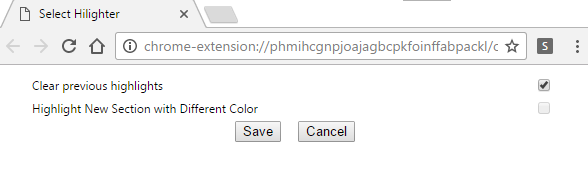
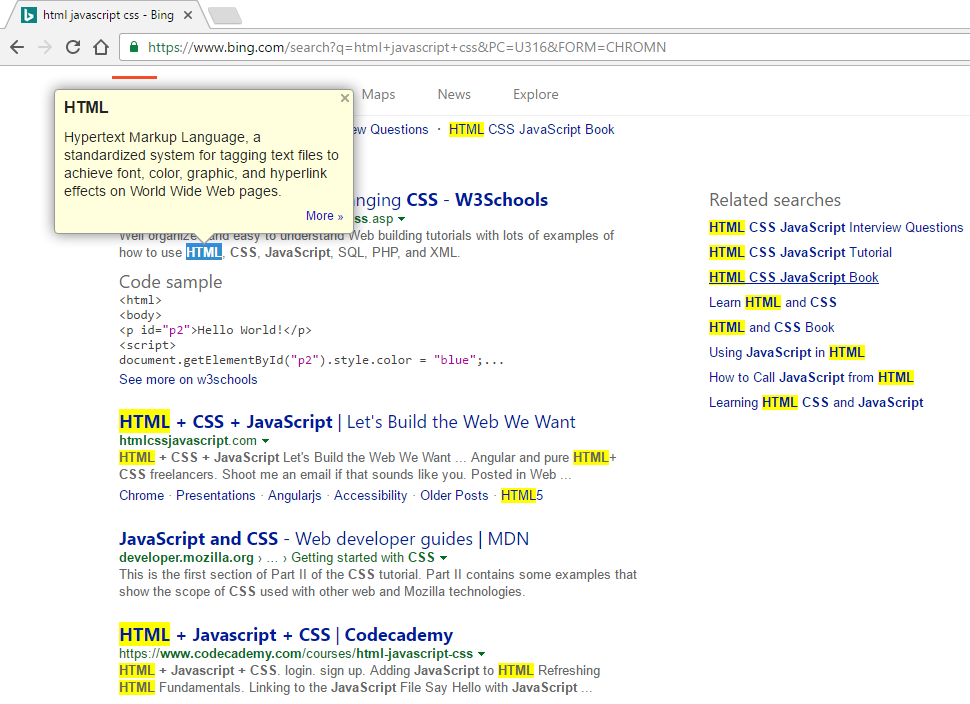
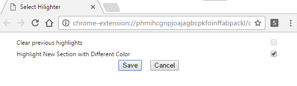
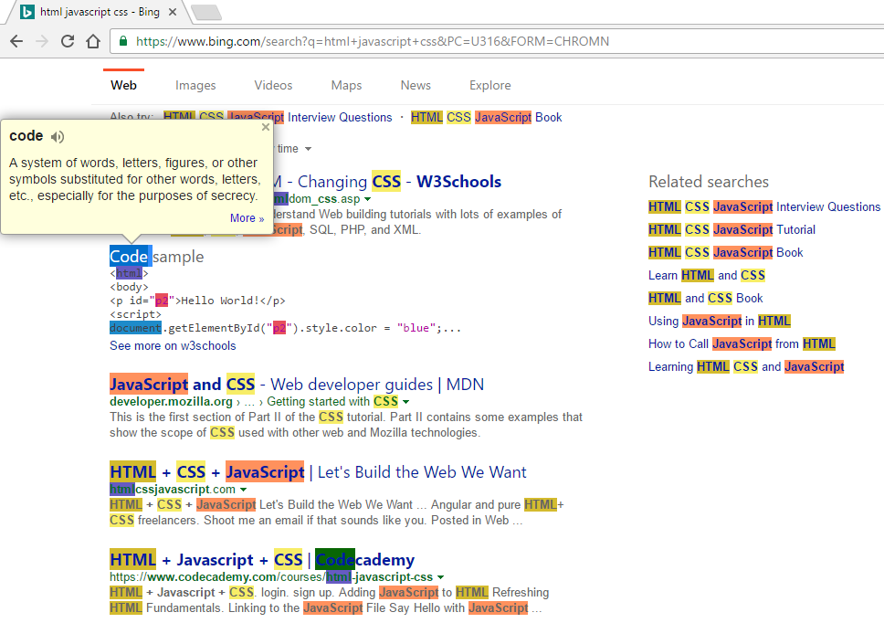

# google-chrome-extension-text-highlighter

The extension shows a test implementation of highlighting all occurences of the *selected(double-clicked)* text 

Extension currently supports 2 options
## Clearing the highlights every time a new word is (double-clicked)selected

Result looks like

The implementation reselects the word, just in case you have any other extenstion, that needs to perform its task.
In my case, "Google Dictionary" shows the definition of the selected word

## Maintaing and using a new (random) color for every new selection 

Result looks like

TODO
====
* Add a landing page for the extension
  * ~~Add option to save highlights previous selects~~(Added)
  * Add option to change color of highlight
* Add (detailed)comments (Added, somewhat)
* Improve logic for re-selection of highlighted word

BUGS
====
* Reselection of double-clicked word on raw files(like *.txt), doesnt work, as expected
* Reselection of double-clicked word on some pages doesn't work on some words depending how they are positioned in the markup.
